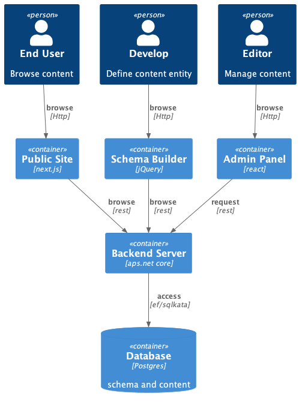

# Fluent CMS
## Why another CMS
- **Performance:** Fluent CMS is 50 times faster than Strapi,as detailed in the [performance-test-fluent-cms-vs-strapi.md](doc%2Fperformance-test-fluent-cms-vs-strapi.md)
It is even 15 times faster than manually writing APIs using ASP.NET/Entity Framework,as detailed in [performance-test-fluent-cms-vs-entity-framework.md](doc%2Fperformance-test-fluent-cms-vs-entity-framework.md)
- **Lightweight:** Thanks to modern tools like Entity Framework, SqlKata, PrimeReact, and JasonEditor, the codebase of Fluent CMS is small, clean, and elegant.
- **Powerful:** With its schema-driven architecture, Fluent CMS saves developers from repetitive work, streamlining the development process.

## Demo / Quick Start
- Admin Panel https://fluent-cms-admin.azurewebsites.net/
  - Email: `admin@cms.com`
  - Password: `Admin1!`  
- Public Site : https://fluent-cms-ui.azurewebsites.net/

For examples, you are developing a cooking blog and you need:
1. An admin panel to manage blog content.
2. REST APIs for mobile and web clients.

With Fluent CMS, there's no need for coding—just some configuration.

### Add entity
1. Login to Admin Panel
   - Go to Admin Panel https://fluent-cms-admin.azurewebsites.net/,  
   - use Email `admin@cms.com`, Password `Admin1!`         
 
2. Navigate to Schema Builder 
   - click the Menu Item  `Schema Builder`         

3. Access the Add Entity Page by 
   - click the Menu Item  `Add Entity`      

4. Fill in the Entity Detail 
   - On the Add Entity Page
     - Entity name: `blogs`
     - Table name: `blogs`
     - Primary Key: `id`
     - Title Attribute: `title`
     - Default Page Size: `20`
     - Entity Title : `Blogs`                
 
5. Add attributes to the entity
   - The system will add 3 system fields `id`, `created_at`, `updated_at` automatically.
   - Add The following attributes:
       - `title`
       - `published_time`   {Database Type: `Datetime`, Display Type: `dateTime`}
       - `body` {Database Type: `Text`, Display Type: `Editor`}   
   - Click the `Update Database` button to save schema and create a table in database.  

6. Add Menu item for Admin Panel's Top Menu Bar
   - Click `Schema List`, 
   - Edit the top-menu-bar, add a new item, 
     - Link: `/entity/blogs` 
     - Label: `Blogs`      

7. Manage Content in Admin Panel
   - Click the `Fluent CMS` logo, go to Admin Panel
   - You can see a new menu item `Blogs` is added, 
   - now you can manage content   

### Add Public API
Fluent CMS generates a set of CRUD Rest APIs, these APIs are protected by Authentication. 
We don't want expose Admin CRUD APIs to public user directly, We want expose API to public by carefully selected
- Attributes to expose
- Order
- Filter
- Page Size for pagination

Follow the follow steps to define a public API
1. Fill the View Detail 
   - Navigate to Schema Builder
   - Click the Menu Item `Add View`
   - Fill the View Detail
     - View Name : `lastest-blog`
     - Entity Name : `blogs`
     - Page Size : 10

2. Fill Sort Detail
   - Click `+ row` button
   - Input the Sort Detail
     - Attribute Name : `published_at`
     - Order Direction: `Desc`
   - Click `Save Schema` button

3. Test the public API
- Access https://fluent-cms-admin.azurewebsites.net/api/views/latest-blogs from browser


### Play it Using Docker

Assuming you have Docker and Docker Compose installed, follow these steps:

1. **Clone the Repository**
   ```shell
   git clone https://github.com/fluent-cms/fluent-cms
   ```

2. **Bring Up Services**
   ```shell
   cd fluent-cms-sqlite-docker
   docker-compose up
   ```

3. **Explore the App**
    - Manage content at [http://localhost:8080](http://localhost:8080) using username `admin@cms.com` and password `Admin1!`
    - View the demo frontend at [http://localhost:3000](http://localhost:3000)

## Play it With Source code
1. **Clone the Repository**
   ```shell
   git clone https://github.com/fluent-cms/fluent-cms
   ```
2. **Start Admin Panel**
   ```shell
   cd server/FluentCMS
   dotnet resotore
   dotnet run
   ```
   - if the above succeed, you will see
   ```shell
   % dotnet run
    Building...
    ***********************************
    Current Connection string is Data Source=cms.db
    ***********************************
    info: Microsoft.Hosting.Lifetime[14]
    Now listening on: http://localhost:5210 
   ```
   - use browser access http://localhost:5210
## System overview

The typical workflow for web development involves:
The normal workflow for web development is:
1. Backend Developers creating tables and defining relationships in databases.
2. Backend Developers creating APIs to perform CRUD (Create, Read, Update, Delete) operations on data.
3. Frontend Developers creating web pages that call these APIs.

Although ORMs and UI frameworks can reduce some of this work, developers often find themselves repeating the same tasks.
As projects progress, adding or removing fields in tables necessitates changes to both the frontend and backend code,
which in turn requires redeploying both applications.

Fluent CMS addresses this issue by not hard coding the backend and frontend to specific entities.
Instead, they read the schema definition to generate APIs.
This means that changing an entity attribute only requires updating the schema definition in the schema builder.

## Server
- asp.net core
- entity framework core
- sqlkata, it using dapper ORM behind the scene(https://sqlkata.com/)

Both entity framework and sqlkata can abstract query from specific Database dialect, so I extract database access to
another layer, currently fluent-cms support postgres sql, it can easily support SQL Server and MySQL in the future. 

